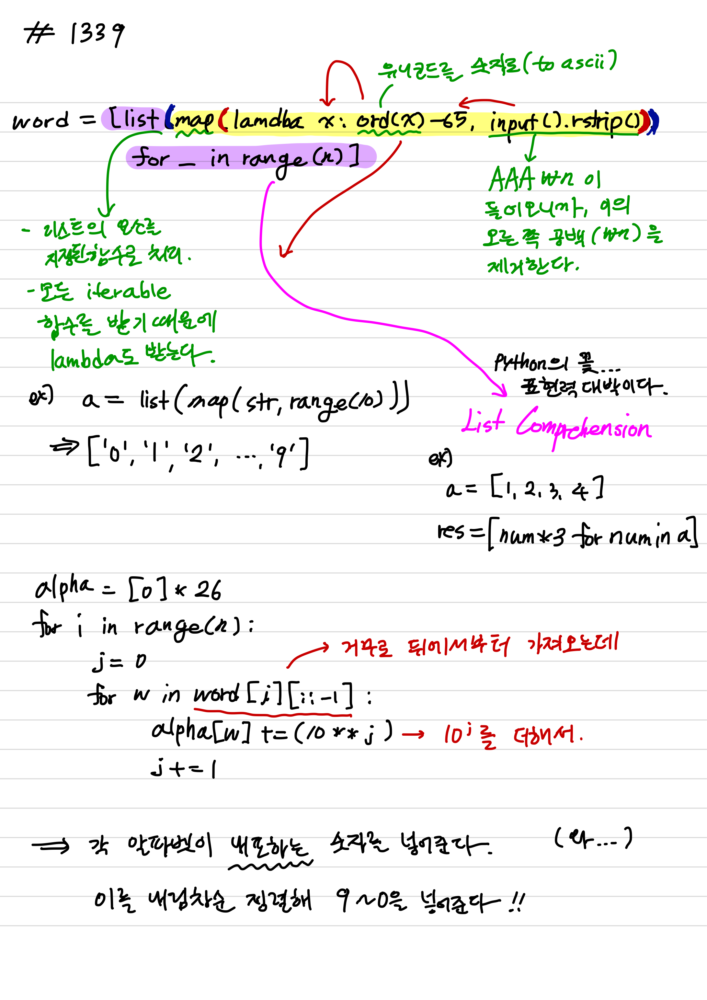
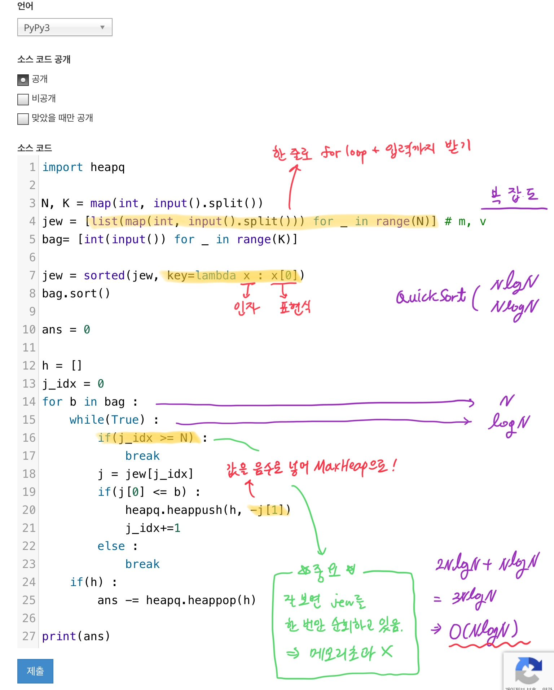

# 목차
<pre>
1. 그리디 알고리즘 정리  

2. <a href="#learn">배운 것</a>  
  - <a href="#1339">Python Lambda, Map, List Comprehension</a>
  - <a href="#1202">Python Sort with labda, for loop map </a>
</pre>

# 𝐆𝐫𝐞𝐞𝐝𝐲 𝐀𝐥𝐠𝐨𝐫𝐢𝐭𝐡𝐦

---

# 𝐈 𝐋𝐞𝐚𝐫𝐧𝐞𝐝...

### 1339 단어 수학

처음으로 파이썬으로 시도하기 시작한 그리디 알고리즘 문제입니다. 해당 필기는 [풀이](https://suri78.tistory.com/183)를 이해하기 위해 작성했으며, `lambda`와 `map` 그리고 `list comprehension`을 이해하게 되었습니다.   

### 1202 보석 도둑
  
한 줄로 for loop을 돌며 list에 입력을 받는 코드를 배웠습니다. 또한, sorting에서 `lambda`를 사용해 정렬의 기준 값을 설정해주는 법을 배웠습니다.  
